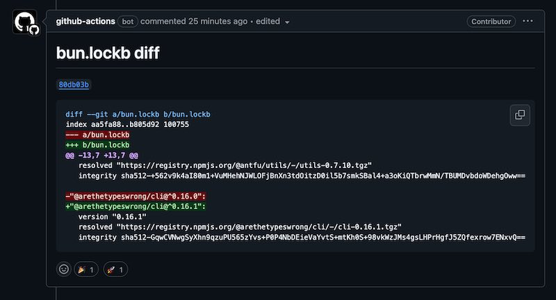

# RobinTail/bun-diff-action

A composite action that writes the diff of `bun.lockb` file into a comment of pull request.
The `diff` syntax is highlighted and the action keeps that comment up to date.



## Requirements

- Running on `pull_request` event,
- Permission to `write` comments to the pull request,
- Check out with `fetch-depth: 0`,
- Install `bun`.

## Usage

```yaml
on: pull_request
permissions:
  pull-requests: write # for comments in PRs
jobs:
  sample:
    runs-on: ubuntu-latest
    steps:
      - name: Checkout
        uses: actions/checkout@v4
        with: # required!
          fetch-depth: 0
      - name: Install bun
        uses: oven-sh/setup-bun@v2
        with:
          bun-version: latest
      - name: Show the bun lock diff
        # in case the workflow has multiple triggers:
        # if: github.event_name == 'pull_request'
        uses: RobinTail/bun-diff-action@v... # set the version
```

### Options

```yaml
with:
  working-directory:
    description: Directory to find bun.lockb file
    required: false
    default: .
```

## Alternatives

- https://github.com/koki-develop/bun-diff-action
  - Written in Typescript,
  - Runs on Node 20,
  - Can install `bun` itself.
